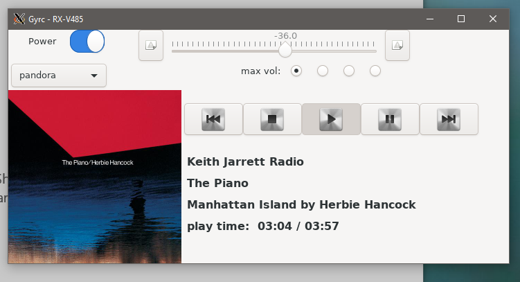

### Gyrc = Gnome Receiver Control

##### Development Journal and Installation Help

A quick introduction:  This is the site for an open-source project on GitHub.  The project is a graphical application for controlling
the network-connected AV receivers made by the Yamaha Corporation.   I am currently researching the implications of using the company's
name in this project, and on this journal.  I just realized I am doing this, so please allow me today to do so.

I was assuming the company would not object to me developing this app, since their API is public.  I need to find out now.

I am not in any way associated with Yamaha, other than owning two of their excellent receivers and two wireless satellite speakers.

Robert Allred
2020-07-15

##### ===============================================================================================================

For now (and probably forever) I'll just use plain text, Thank you.

[Development branch of Gyrc](https://github.com/balinbob/yrc/tree/development)

2020-07-15 update

This is becoming more of a cross between a blog/journal of the development of Gyrc, and the instructions to install it, so here we go.  Maybe someday it'll be formatted, but for now it continues to be mostly plain text.

The big news for me is that, last night, I got it to run successfully on Windows 10.  Since it uses GTK+, it must run under the Windows Subsystem for Linux 2.  That has to be present and working on the Windows installation.   I'm using the Debian distribution from the software store on Windows.  Setting that up is not difficult, but it is beyond the scope of this project.   Also, the average user of Windows probably will not want to go to the lengths I did to get it running.

But here is a screenshot of it:

2020-07-07

yrc, or Gyrc, is an app I've been looking for, for years, to control my Yamaha network receiver from my computer (in addition to the great apps for iPhone).

I found pymusiccast on Github, it is a library for doing so in Python.   So I had to write my own GUI for it, and it is now working (for me anyway).  The only configuration is to enter the ip address or hostname of your receiver, which if you use Linux, you can probably locate.   If you decide to try the app, please do so using the button at the top-right that says IP.  After you've entered something, like say 192.168.1.130 (mine, not yours probably), it will be written to a simple text file at ~/.gyrc.cfg.  Thereafter, the app will try to get the receiver's IP address from that file.  If you need to change it, just delete the file and next time you start Gyrc (Yamaha Receiver Control) it will once again show the IP button.

You'll also need to copy the icons from the images directory to ~/.gyrc/icons/  It won't start without them, currently.  In the meantime, look at the screenshots.

There are some depencencies, purely Python, besides pymusiccast.  You'll need the GTK+ (3) libraries which come with GNOME, plus:
1. python3.x
2. requests
3. pymusiccast

(of course)

Install python, then get pip3 and use it do install pymusiccast, etc. This is sort of DIY right now.

For now, once you've done that, edit the source code in wherever you git cloned the app in libgyrc/gyrc.py.  You'll see it at the top of the first (Yamawin) class.   If you can figure that out, you're ready to go, the rest should be obvious, but please be patient as it is under development (not fully functional and probably has bugs). Definitely has bugs, I'm sure.   It works great for me, though.

Also, please feel free to browse my code.

If anyone knows if you can run this under another OS, or what I need to do, please let me know.

Thank you,

balinbob

Bob Allred

[Link to Gyrc code](https://github.com/balinbob/yrc)

